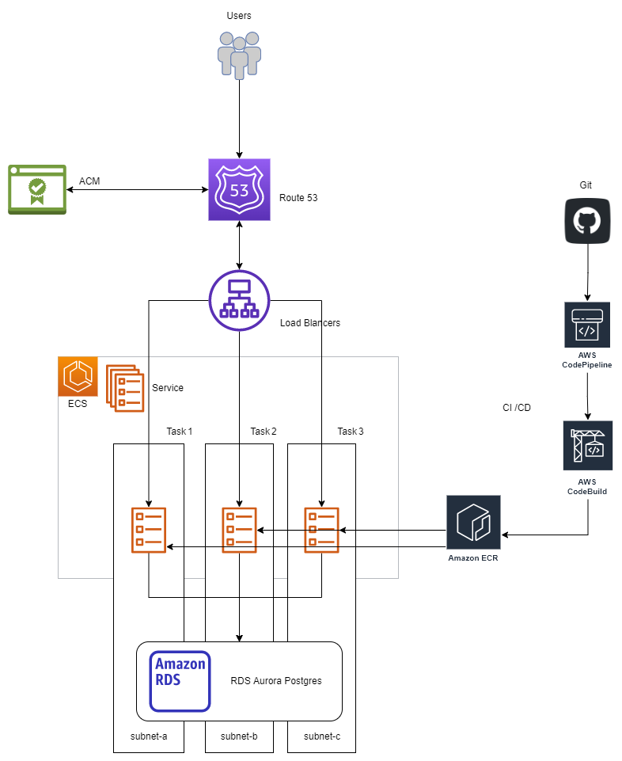

# Servian Tech App Challenge 
----

## Technology Choices

#### App details
     

#### Infrastructure
 - Amazon Elastic Container Service (ECS)
 - Amazon Elastic Load Balancing (ALB)
 - Amazon Relational Database Service (RDS)
 - Amazon Certificate Manager (ACM)
 - Amazon Route 53
 - Amazon Simple Storage Service (S3)
 - AWS Identity and Access Management (IAM)
 - Amazon Security Groups
#### CI/CD
 - Github for code
 - Code pipeline - Automate release
 - Codebuild - build container image 
 - ECR - Container Repository
#### IAC
- AWS CLI
#### Before Depolyment
Code Repo
-  ` git clone https://github.com/servian/TechChallengeApp.git `

Make changes to docker file
- ``RUN echo "./TechChallengeApp updatedb; ./TechChallengeApp serve" > trigger.sh
EXPOSE 8080 
ENTRYPOINT [ "/bin/sh", "trigger.sh"] ``

update DB config
-  update conf.toml

----
## Architecture

----

## IAC Deployment
<pre><code>

 wget https://raw.githubusercontent.com/anuvindhs/Servian-Tech-ChallengeAppSolution/main/assets/install.sh -q -O -| bash 
 </code></pre>

 <pre><code>

chmod u+x install.sh 
 </code></pre>

<pre><code>
./install.sh
 </code></pre>
 
-----------